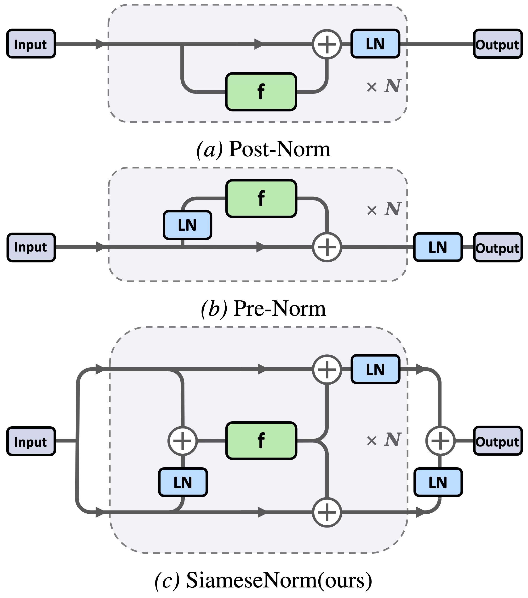

## [ICML 2026] SiameseNorm: Breaking the Barrier to Reconciling Pre/Post-Norm

This repository contains the official implementation of paper [SiameseNorm: Breaking the Barrier to Reconciling Pre/Post-Norm](https://arxiv.org/abs/2602.08064).

### News
May 22, 2026: We provide SiameseNorm implementations for [DeiT](https://github.com/facebookresearch/deit) and [DiT](https://github.com/facebookresearch/DiT). These implementations can be integrated into the corresponding official repositories by replacing the relevant modules, while keeping the original training and evaluation pipelines unchanged.
#### Cross-Modal Generality

| Model | Metric | Pre-Norm | SiameseNorm |
|---|---|---:|---:|
| DeiT-T ($L=12$) | Acc $\uparrow$ | 72.2 | **73.6** |
| DeiT-S ($L=12$) | Acc $\uparrow$ | 79.8 | **81.3** |
| DiT-B/2 ($L=12$) | FID $\downarrow$ | 42.43 | **40.31** |
| DiT-L/4 ($L=24$) | FID $\downarrow$ | 45.21 | **41.34** |

May 1, 2026: Paper accepted to ICML 2026.

### Abstract

------------

The long-standing tension between Pre- and Post-Norm remains an open problem in Transformer architecture, reflecting a fundamental trade-off between training stability and representational capacity. Prior attempts to combine their strengths have made progress, but often show limited robustness across training settings, restricting their broader applicability. We revisit this dilemma, showing that \emph{single-stream} architectures struggle to reconcile Pre-Norm's stable identity-gradient propagation with Post-Norm's normalization of the main residual path. To address this structural tension, we propose SiameseNorm, a simple yet effective \emph{two-stream} architecture that remains compatible with Pre-Norm training recipes. SiameseNorm couples Pre-Norm-like and Post-Norm-like streams through shared residual blocks, allowing each residual block to receive optimization signals from both pathways with negligible overhead. Extensive experiments on 400M and 1.3B dense language models, 15B MoE models, Vision Transformers, and Diffusion Transformers show that SiameseNorm consistently improves performance while maintaining strong training stability across architectures and modalities.

<div align="center">
  
</div>

Architectural comparison of Post-Norm, Pre-Norm and SiameseNorm. In SiameseNorm, the input is duplicated into parallel streams sharing identical residual updates, where distinct LN positioning differentiates the hidden states across layers.

### Installation

-----------

#### 1. Clone this repository
```
git clone https://github.com/Qwen-Applications/SiameseNorm.git
cd SiameseNorm
```
#### 2. Apply modifications
```
# 1. Initialize the submodule
git submodule update --init --recursive

# 2. Enter the submodule directory
cd OLMo

# 3. Apply the patch file
git apply ../changes.patch
# 4. Install dependencies
pip install -e .[all]
```

### Training

First, prepare the data and fill in the address in the config.


```
cd OLMo

# For Pre-Norm
export MODEL_TYPE="pre"
torchrun --nproc_per_node 8 scripts/train.py configs/exps/OLMo-1B-2e-3.yaml
# For Hyper-Connection
export MODEL_TYPE="hc"
torchrun --nproc_per_node 8 scripts/train.py configs/exps/OLMo-1B-2e-3.yaml
# For SiameseNorm(post-pre)
export MODEL_TYPE="post_pre"
torchrun --nproc_per_node 8 scripts/train.py configs/exps/OLMo-1B-2e-3.yaml
# For SiameseNorm(hybrid-pre)
export MODEL_TYPE="hybrid_pre"
torchrun --nproc_per_node 8 scripts/train.py configs/exps/OLMo-1B-hybrid-2e-3.yaml
```

### Citing this work

-----------

If you find this work helpful or use it in your research, please consider citing our paper:

```
@article{li2026siamesenorm,
  title={SiameseNorm: Breaking the Barrier to Reconciling Pre/Post-Norm},
  author={Li, Tianyu and Han, Dongchen and Cao, Zixuan and Huang, Haofeng and Zhou, Mengyu and Chen, Ming and Zhao, Erchao and Jiang, Xiaoxi and Jiang, Guanjun and Huang, Gao},
  journal={arXiv preprint arXiv:2602.08064},
  year={2026}
}
```

### Acknowledgment

-----------

The code is based on [OLMo](https://github.com/allenai/OLMo) and [HybridNorm](https://github.com/BryceZhuo/HybridNorm).
